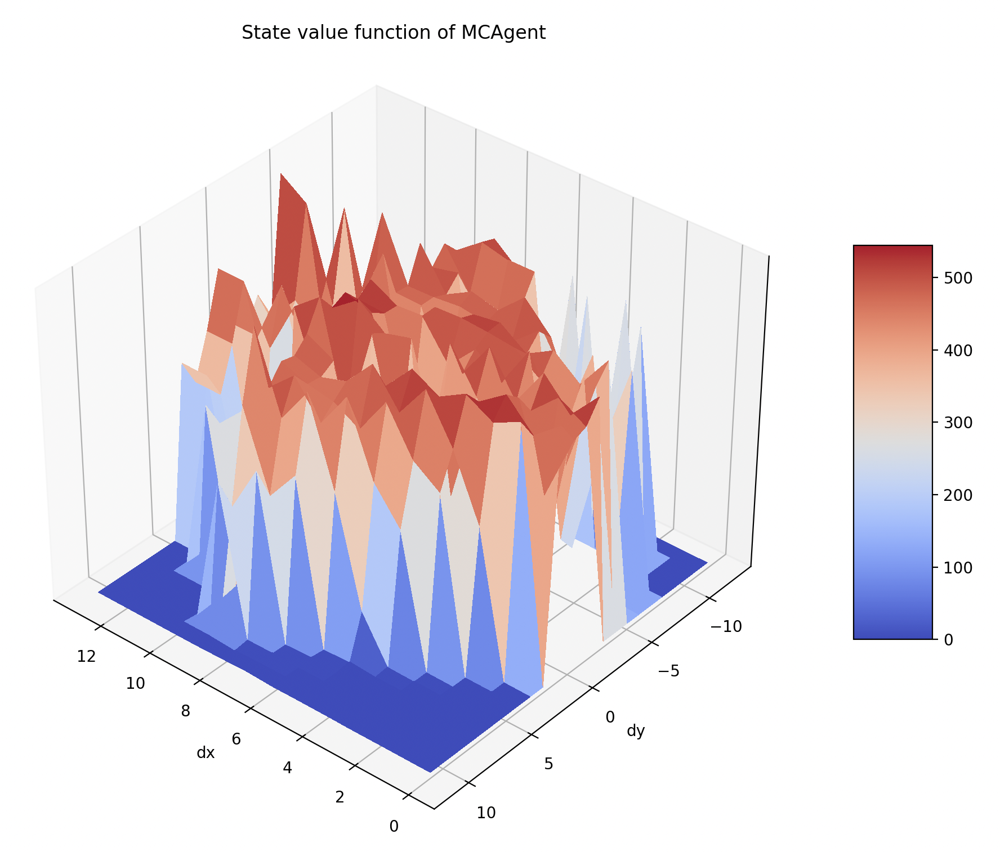
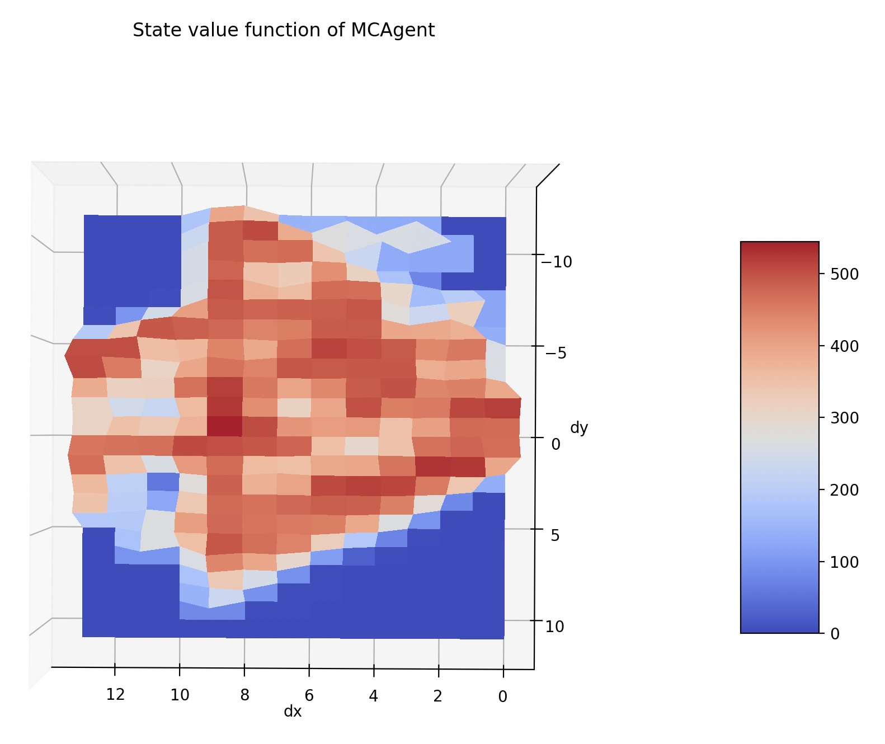
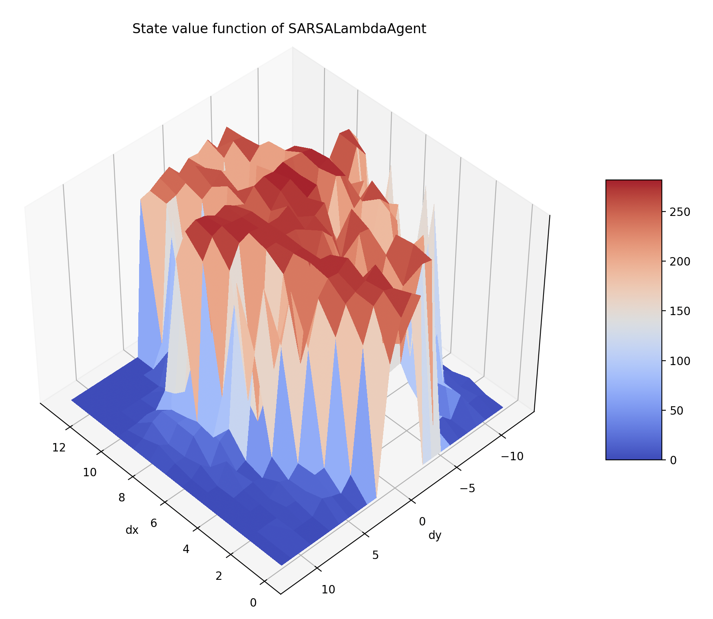
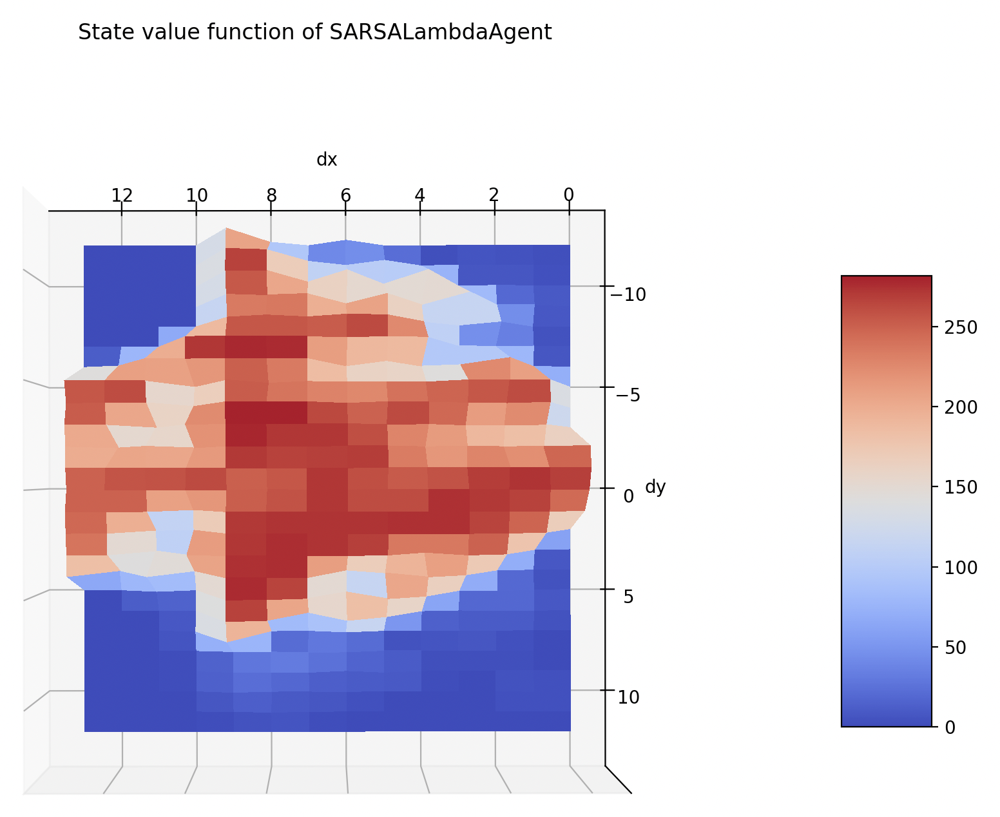

# Playing Flappy Bird with RL

**Authors:** Tom LABIAUSSE

**Date:** March 2024

## Setup

Install the requirements:
```bash
pip install -r requirements.txt
```

Install the flappy bird environments:
```bash
pip install git+https://gitlab-research.centralesupelec.fr/stergios.christodoulidis/text-flappy-bird-gym.git
```

## Files

* `agents.py`: implementation of tabular RL agents
* `trainers.py`: implementation of trainers for the agents
* `utils.py`: utility functions and variables
* `main.py`: launch training/agent demo

## Training & Demo

Train a Monte Carlo agent:
```bash
python main.py --mc
```

Train a Sarsa(lambda) agent:
```bash
python main.py --sarsa-lambda
```

Demo with a save agent:
```bash
python main.py --mc --demo
python main.py --sarsa-lambda --demo
```

Change all environment/training parameters directly in `main.py`.

## Results

### MC Agent




### Sarsa($\lambda$) Agent



